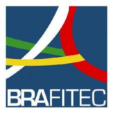
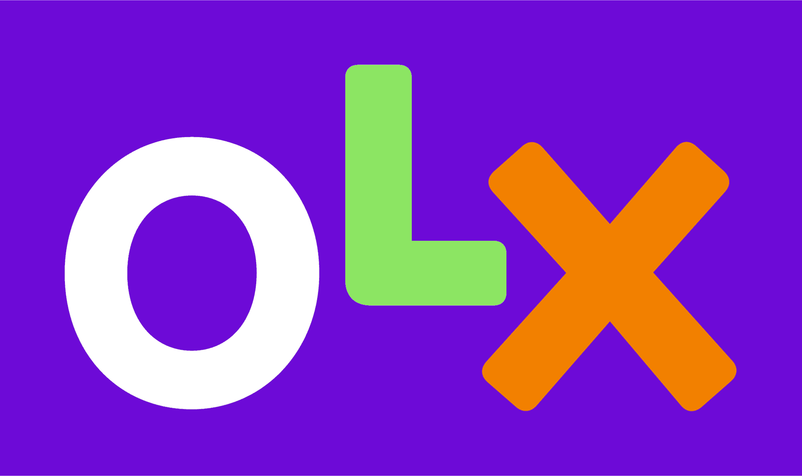

# 🌟 Outros

## Honras e Prêmios

&nbsp <strong>  BRAFITEC </strong>  
&nbsp Lille, França, 2022  

* 
O **BRAFITEC** (BRAsil France Ingénieur TECnologia) é um Programa de Intercâmbio desenvolvido no âmbito da cooperação entre o Brasil e a França e que se organiza por meio de parcerias universitárias nas diferentes áreas de Engenharia. Seus objetivos são promover o intercâmbio de estudantes de graduação e de professores em engenharia e estimular iniciativas de alinhamento de programas e conteúdos de ensino, facilitando o reconhecimento recíproco de créditos obtidos junto às instituições conveniadas. Do lado brasileiro, o financiamento das bolsas de estudos é de responsabilidade da Coordenação de Aperfeiçoamento de Pessoal de Nível Superior **(Capes)**.

* 
Concedido a menos de 1% dos estudantes de engenharia no Brasil.

&nbsp <strong>  HACKTUDO OLX- Festival de Cultura Digital </strong>  
&nbsp OLX, 2023  

* Tema: <strong>Como melhorar a experiência do usuário de segunda mão da OLX</strong>
* Primeira colocação da competição, em que estivemos concorrendo com 93 equipes de todo o Brasil!
* 
 O projeto vencedor foi baseado em uma tecnologia de realidade aumentada para a projeção de imagens 3D, o qual chamamos de VisiOnLX, e uma tecnologia de inteligência artificial, chamada de OLXat, que se utiliza de Natural Language Processing (NLP) para fornecer recomendações ao usuário através de um algoritmo de sistemas de recomendação, por meio de características que interessam ao cliente.

## Descubra mais sobre mim:

  <a href="../" class="md-button md-button--primary">👋 Apresentação</a>
  <a href="/cv/education" class="md-button md-button--primary">📚 Educação</a>
  <a href="/cv/professional" class="md-button md-button--primary">🛠️ Experiência</a>
  <a href="#" class="md-button md-button--primary">🌟 Outros</a>

