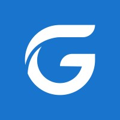
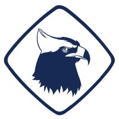
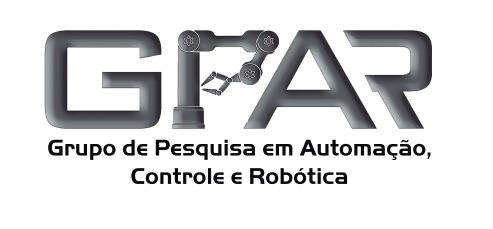
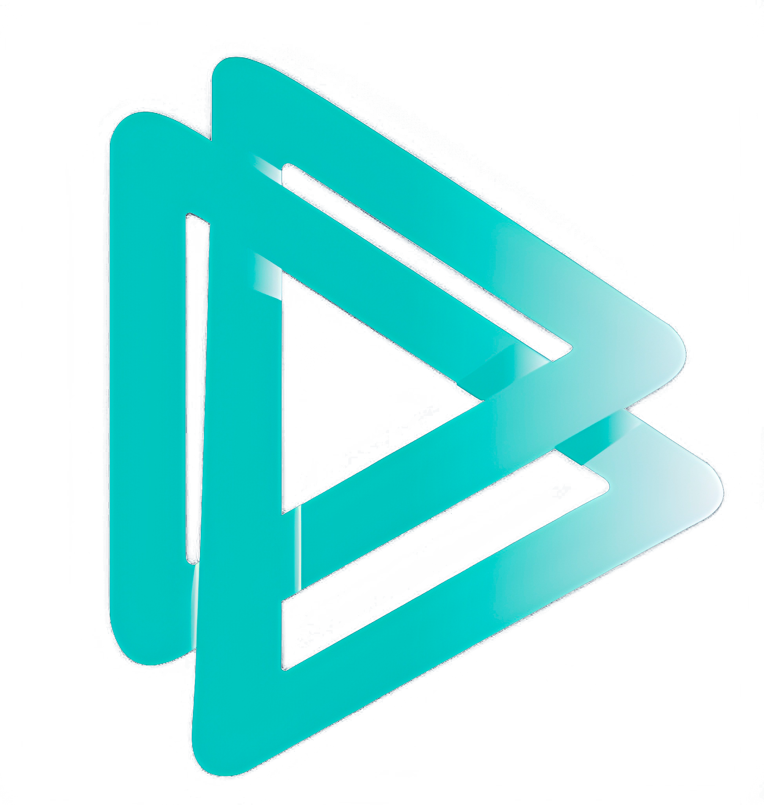

# 🛠️ Experiência 
## Experiência Profissional

&nbsp <strong> Estágio em Ciência de Dados</strong>  
&nbsp Visagio   
&nbsp 2024 – Atual

* 

Desenvolvimento de um copiloto de IA Generativa para uma relevante rede varejista no Rio de Janeiro. O
copiloto realiza a conversão de texto para SQL, utilizando tecnologias como Python, LangChain, FastAPI,
SQLAlchemy, PostgreSQL, MS SQL e React.

* 

Realização de análise de clusterização de clientes para uma grande cervejaria da América Latina, empregando
o método K-medoids. Também fornecemos suporte à tomada de decisão empresarial com a classificação de
clientes por meio de um Classificador baseado em Árvore de Decisão.

 

&nbsp <strong> Projeto de Inteligência Competitiva</strong>  
&nbsp Goaland   
&nbsp 2022 – 2024

* 

Ampliação do uso de uma plataforma de inteligência competitiva da empresa GOALAND, resultando na
aprovação e validação de 2 novas áreas de atuação pela empresa cliente.

 

## Experiência Acadêmica

&nbsp <strong> Membro Estudantil</strong>  
&nbsp Ramo Estudantil IEEE UFC Fortaleza   
&nbsp 2021 – 2024

* 

Ampliação do uso de uma plataforma de inteligência competitiva da empresa GOALAND, resultando na aprovação e validação de 2 novas áreas de atuação pela empresa cliente.

 

&nbsp <strong> Membro Bolsista</strong>  
&nbsp Grupo de Pesquisa em Automação, Controle e Robótica <strong>(G.P.A.R.)</strong>   
&nbsp 2021 – 2022

* 

Bolsa de Excelência: Estudo e implementação de controladores PI e PID sintetizados com inteligência artificial aplicados ao controle de um manipulador cilíndrico usando motores de indução trifásicos
- Orientadora: [PhD. Laurinda Lúcia Nogueira dos Reis](http://lattes.cnpq.br/2873675973303728) 

 

&nbsp <strong> Membro Bolsista</strong>  
&nbsp Programa de Educação Tutorial   
&nbsp 2020 – 2021

* 

Programa de educação, pesquisa e extensão no qual aprimorei minhas habilidades sociais e competência profissional por meio da organização de eventos, desenvolvimento de pesquisas científicas e ministração de aulas a alunos do Ensino Médio.

 

&nbsp <strong> Coordenador Geral</strong>  
&nbsp Semana de Engenharia Elétrica, Computação e Telecomunicações <strong>(SEELECT)</strong>    
&nbsp 2021

* Idealização do evento
* Organização e formação do time organizacional
* Experiência de Liderança

 

## Descubra mais sobre mim:

    <a href="../" class="md-button md-button--primary">👋 Apresentação</a>
    <a href="/cv/education" class="md-button md-button--primary">📚 Educação</a>
    <a href="#" class="md-button md-button--primary">🛠️ Experiência</a>
    <a href="/cv/others" class="md-button md-button--primary">🌟 Outros</a>

